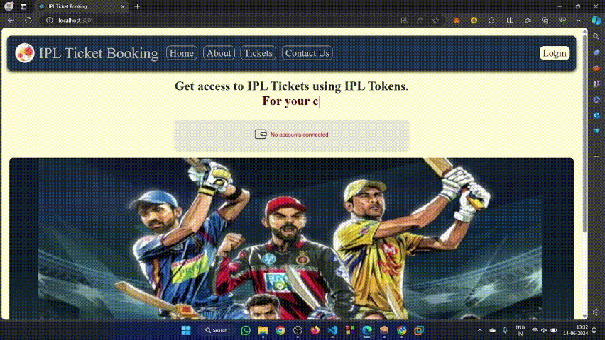
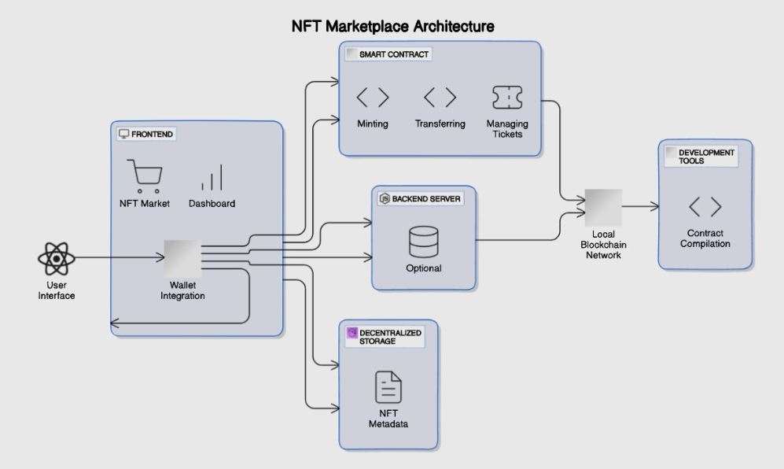

# Existing Problem
Traditional ticketing methods face several challenges:

1. **Counterfeiting**: Fake tickets are often created and sold, leading to financial losses and security concerns.
2. **Scalping**: Unauthorized reselling of tickets at inflated prices, which exploits genuine fans.
3. **Lack of Transparency**: It is difficult to track the ownership and transfer of tickets, leading to issues in verifying their authenticity.

These problems are particularly prevalent in large-scale events like the Indian Premier League (IPL). The study explores the integration of blockchain technology, particularly through Non-Fungible Tokens (NFTs), into the IPL ticketing system to address these issues and align with Sustainable Development Goal (SDG) 12, specifically Target 12.5, which aims to reduce waste generation through prevention, reduction, recycling, and reuse.

# How NFTs Provide a Solution

- Uniqueness and Verifiability
- Transparent Tracking
- Secure and Facilitated Resale
- Substantially reduce waste generation through prevention, reduction, recycling, and reuse
- Circular economy

# SDG
**SDG 12**
> Responsible Consumption & Production

**Target - 12.5**
> By 2030, substantially reduce waste generation through prevention, reduction, recycling, and reuse.

# Team
[Ananya Deshpande](https://github.com/AnanyaDeshpande)
\
[Khushi Appannavar](https://github.com/Khushi-MA)
\
[Risheek Hiremath](https://github.com)
\
[Sanjana Kurkuri](https://github.com/SanjanaKurkuri)

# Proposed solution

[Click to watch the video](https://github.com/AnanyaDeshpande/NFT/blob/main/src/assets/nftcut.mp4)

## Flow diagram

## Platform in a Nutshell

**User Experience:**

* Browse & view NFTs
* Manage user accounts
* Connect crypto wallets (e.g., MetaMask) for secure transactions

**Core System:**

* Backend server handles application logic and interacts with blockchain
* Smart contract manages NFT creation, sale, transfer, and ownership

**Technical Stack:**

* Smart contract development tools (Truffle, Hardhat)
* Frontend development tools (React, Web3.js/Ethers.js)
* Local blockchain testing (optional)
* Blockchain network (Ethereum, Polygon, etc.)
* Off-chain NFT metadata storage (IPFS)

# Requirements

1. **React:**
   The project is bootstrapped with Create React App. Ensure that React and related libraries are installed.

2. **Node.js and npm:**
   Ensure a compatible version of Node.js is installed; Create React App recommends Node >= 14.0.0 and npm >= 5.6.

3. **Browserslist:**
   This affects how Babel and other tools compile and polyfill the JavaScript code.

4. **Truffle:**
   Mentioned as the main entry point (`"main": "truffle-config.js"`), indicating that the project involves Ethereum smart contract development.

5. **Hardhat:**
   Several Hardhat-related packages (`@nomiclabs/hardhat-ethers`, `@nomiclabs/hardhat-waffle`, `hardhat`) are listed under `devDependencies`. This is an alternative to Truffle, offering similar functionalities.

6. **Ethers.js:**
   The `ethers` package is a library for interacting with the Ethereum blockchain and its ecosystem.

7. **Ethereum Waffle:**
   Included in `devDependencies` (`"ethereum-waffle": "^4.0.10"`), it's a library for writing and testing smart contracts.

8. **@types/sinon-chai:**
   This is a TypeScript declaration package for Sinon-Chai.
